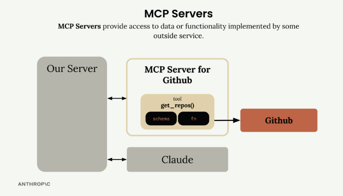
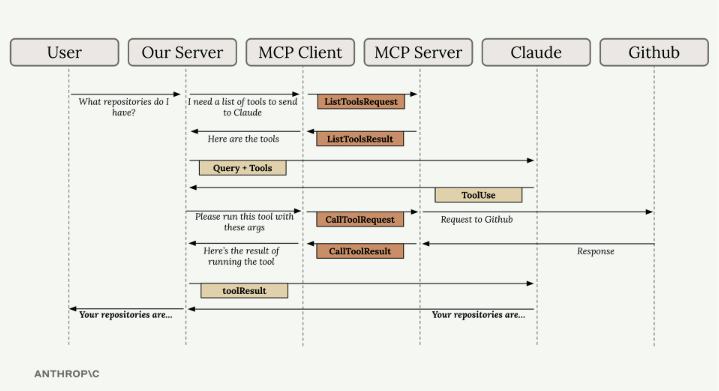

# mcp-tool-bridge
MCP servers provide access to data or functionality implemented by outside services. They act as specialized interfaces that expose tools, prompts, and resources in a standardized way.

## Project Structure
In our Github example, the MCP Server for Github contains tools like get_repos() and connects directly to Github's API. Your server communicates with the MCP server, which handles all the GitHub-specific implementation details.

  <table>
    <tr>
      <td align="center">
        
         
        <i>MCP Server for Github</i>
      </td>
    </tr>
    <tr>
      <td align="center">
        
         
        <i>Step by Step Flow</i>
      </td>
    </tr>
  </table>

